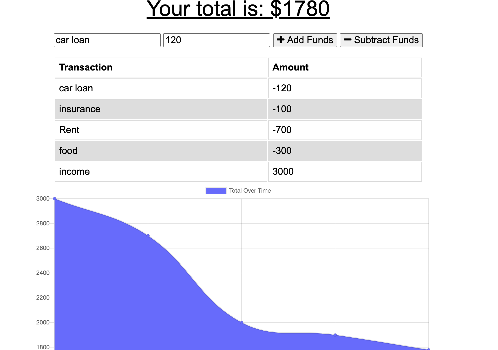

# Budget Tracker

## Description

The Budget Tracker is an easy way to track your expenses on and offline.

## Table of Contents

* [Usage](#usage)

* [Technology](#Technology)

* [Questions](#questions)

## Usage
Deployed webpage:

Whether you have internet or not use this app to track your monthly budget expenses. Just enter your income and expenses, and it will automatically generate a graph with that information.

## Technology

JavaScript, Express, Mongo, Mongoose, Node.js, CSS, HTML, PWA.

## Questions

Mónica Polanco Fabián | MonicaPolancoFabian15@gmail.com
